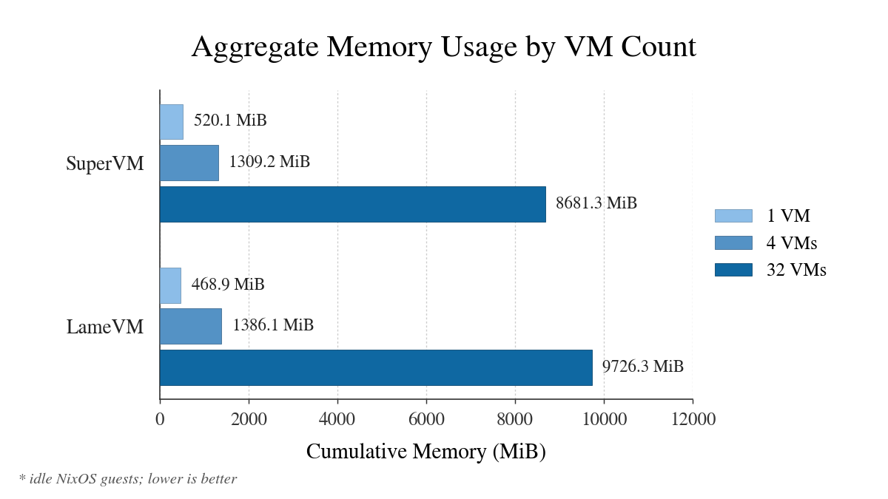

# SuperVM

> [!WARNING]
> Experimental Demo, Not Audited! Works on x86_64.

SuperVM is an aggressively memory-optimized runner for heterogeneous VMs.
SuperVM VMs can run different packages, services, etc, but must use NixOS. Any
software packages from public Nix caches are stored exactly once on disk and
cached once in shared memory across all guests; private state remains private.

```console
nix run .#supervm -- prepare ./my-vm
nix run .#supervm -- launch ./my-vm
```

Yet, each guest retains its own kernel, distinct writable Nix store, and state
that is invisible to every other guest.

## Why this exists

SuperVM is a proof of concept for seeing how far VM memory efficiency can be
pushed under production constraints using selective kernel-page merging and
policy-controlled sharing of Nix package files. It demonstrates that we can
exercise granular control over what enters shared memory, avoiding broad
cache-side-channel exposure. The same mechanism has near-zero discovery cost at
runtime: known pages are mapped directly rather than found by scanning memory
for duplicates, so the safer approach is also faster than scan-based
deduplication.

## Why it is so efficient

Firstly, SuperVM makes the core kernel text and rodata in each guest's memory
KSM-mergeable, so VMs running the same kernel share one physical copy of those
pages. Notably, no other guest memory is eligible. This cuts the overhead of the
read-only kernel image without scanning changeable or secret data, where
copy-on-write churn would hurt performance and merging could create side
channels.

Secondly, Nix packages can annotate which files, including binaries, are safe to
share; unmarked files never enter the shared cache. SuperVM applies that policy
file by file, serving annotated files from one common cache instead of copying
them into every VM. This captures most of the memory savings without exposing
secret-handling code to cross-guest cache side-channel attacks.

SuperVM is built around a patched crosvm, which provides the memory mappings
these mechanisms need. Its stripped build has Firecracker-class overhead: 6.7
MiB of measured host memory per VM outside guest RAM, versus 2.8 MiB for
Firecracker.

## How much memory it saves

These figures were measured with `bench/` (idle fixed-count runs at 1, 4,
and 32 VMs on 512 MiB minimal NixOS guests).

### Per-VM savings

Marginal cost of each additional VM, measured at 32 VMs:

| Per VM                   | vanilla crosvm | SuperVM      |
| ------------------------ | -------------- | ------------ |
| Guest memory (resident)  | ~289 MiB       | ~289 MiB     |
| KSM: kernel text, rodata | —              | −27 MiB      |
| DAX: store content       | —              | −18 MiB      |
| virtio-fs server         | —              | +3 MiB       |
| Other host overhead      | ~10 MiB        | ~16 MiB      |
| **Total**                | **~299 MiB**   | **~263 MiB** |

At 32 VMs the deployments measure 9.5 GiB against 8.5 GiB.

### Fixed overhead (not per-VM)

| Shared, once per host             | SuperVM     |
| --------------------------------- | ----------- |
| DAX pool (this closure)           | ~54 MiB     |
| Metadata index                    | ~11 MiB     |
| Snix daemons                      | ~40 MiB     |

## Charts



## Run it

Use a Linux host with Nix flakes and KVM.

Preparation builds the guest and adds its packages to the shared store.
Launching boots that prepared guest with the state folder as its private layer.

Prepare first:

```console
nix run .#supervm -- prepare ./vm-a
nix run .#supervm -- prepare ./vm-b
```

Then, start the VMs in two terminals:

```console
nix run .#supervm -- launch ./vm-a
nix run .#supervm -- launch ./vm-b
```

The optional `--profile` flag selects a NixOS configuration:

```console
nix run .#supervm -- prepare --profile ./machines#web ./vm-web
nix run .#supervm -- launch ./vm-web
```

`launch` boots the last successfully prepared runner without evaluating the
guest again.

Select `--dax=never`, `--dax=inode` (the default), or `--dax=always` while
preparing:

```console
nix run .#supervm -- prepare --dax=always ./vm-a
nix run .#supervm -- launch ./vm-a
```

## Compare with vanilla crosvm

`lamevm` runs the same NixOS guest with mainline microvm.nix and nixpkgs crosvm:

```console
nix run .#lamevm -- prepare ./baseline-vm
nix run .#lamevm -- launch ./baseline-vm
```

As with SuperVM, select a profile while preparing; `launch` reuses the prepared
runner without evaluating it again:

```console
nix run .#lamevm -- prepare --profile ./machines#web ./baseline-web
nix run .#lamevm -- launch ./baseline-web
```

For a fair comparison, run multiple instances of each, since SuperVM's benefit
comes from sharing common pages between guests. If you just want to see how much
performance SuperVM can achieve, pass `--dax=always` so every common store page
is shared. Alternatively, to test the production-style fine-grained sharing
policy used to avoid cross-guest cache side channels, use the default
`--dax=inode` mode and add an `$out/nix-support/fsmeta` file to packages whose
files should be shared. Each line in `fsmeta` has the form
`snix.dax <path-relative-to-the-package-root>`, for example
`snix.dax bin/example`; listed files enter the shared cache, whereas unlisted
files stay out.
